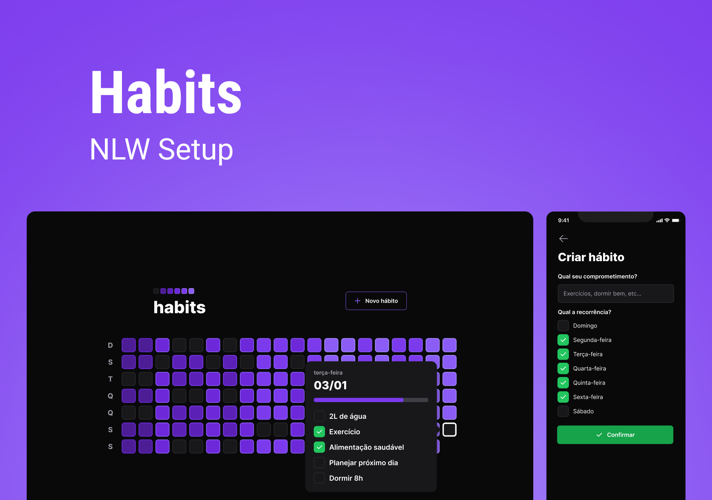
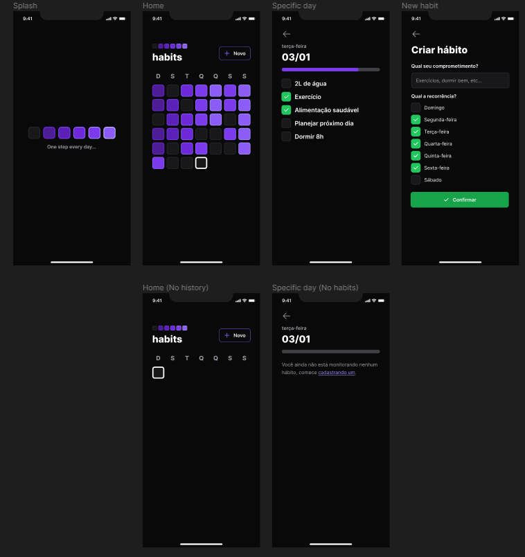
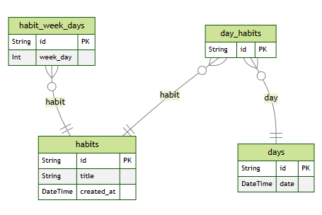

<h1 align="center"> Habits </h1>

  <a href="#-tecnologias">Tecnologias</a>&nbsp;&nbsp;&nbsp;|&nbsp;&nbsp;&nbsp;
  <a href="#-projeto">Projeto</a>&nbsp;&nbsp;&nbsp;&nbsp;&nbsp;&nbsp;</a>

 

<h2 align="center"> Cover </h2>

  

<h2 align="center"> Mobile Preview </h2>

  

## 🚀 Tecnologias

Esse projeto foi desenvolvido com as seguintes tecnologias:

- 💻 #Web Front end :

- [TypeScript](https://www.typescriptlang.org/)
- [React](https://reactjs.org/)
- [Tailwind](https://tailwindcss.com/)
- [Vite](https://vitejs.dev/)

---

- ⚙️ #Back end :

- [Prisma](https://www.prisma.io/)
- [Node.js](https://nodejs.org/en/)
- [Axios](https://github.com/axios/axios)
- [Zod](https://github.com/colinhacks/zod)
- [Fastify - Cors, JWT](https://www.fastify.io/)
- [Mermaid-js/mermaid-cli (ERD Diagram)](https://github.com/mermaid-js/mermaid-cli)

---

- 📱 #Mobile :

- [Expo](https://expo.dev/)
- [React Native](https://reactnative.dev/)
- [Phosphor Icons](https://phosphoricons.com/)
- [React Navigation](https://reactnavigation.org/)
- [Nativewind](https://www.nativewind.dev/)

## 💻 Projeto

O Habits é um projeto feito durante a semana NLW da Rocketseat que visa ajudar as pessoas a criarem e manterem hábitos saudáveis, como por exemplo, ler um livro por mês, fazer exercícios físicos, etc.

#### Funcionalidades Mobile:

- [x] Visualizar hábitos do mês atual
- [x] Criar novos hábitos
- [x] Marcar hábitos como concluídos ou não concluídos
- [x] Visualizar hábitos de um dia específico

---

Feito com ♥ by Gustavo Batista :wave: [LinkedIn](https://www.linkedin.com/in/gustavo-h-batista/) e [GitHub](https://github.com/gustavohdab)
